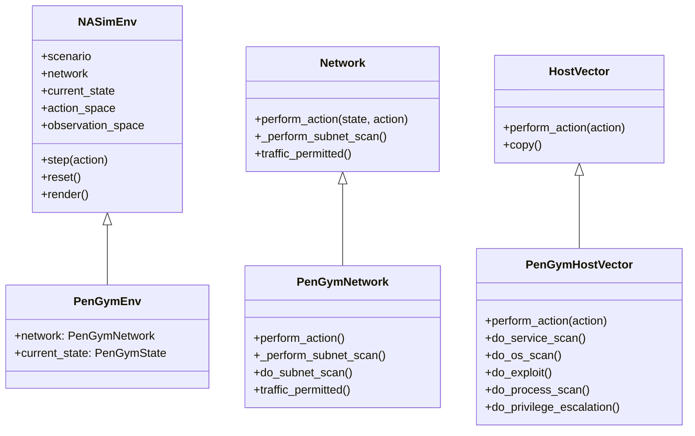
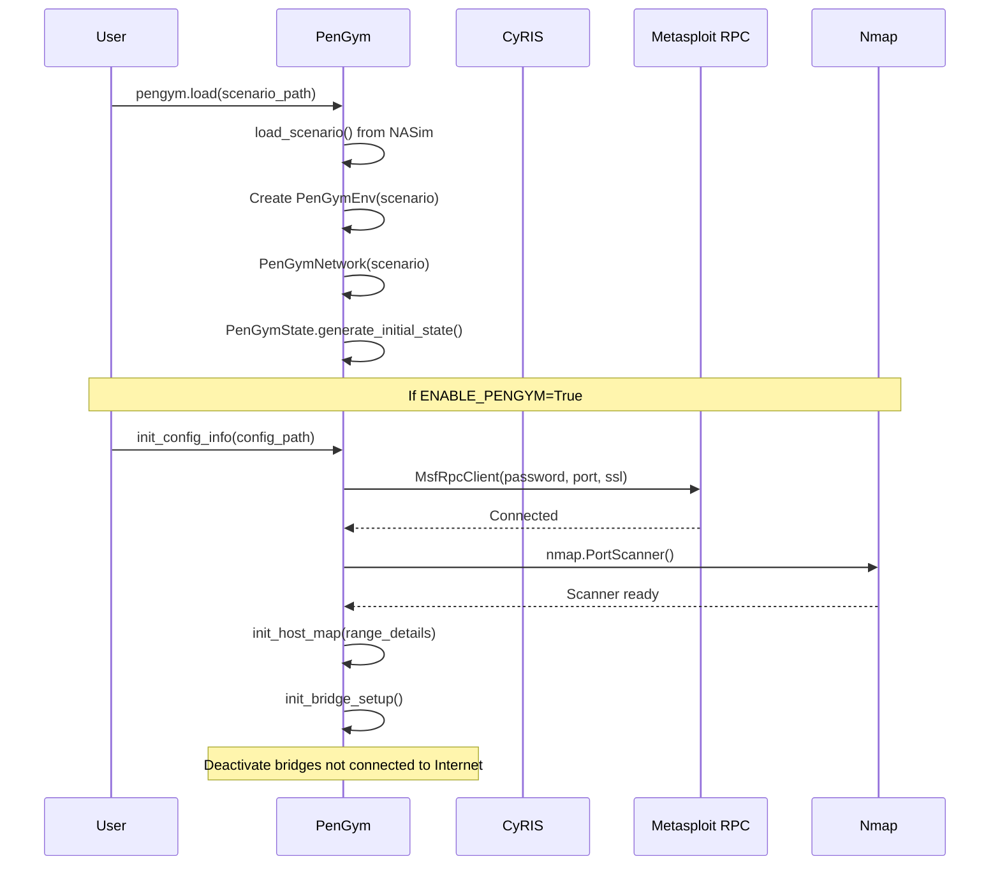
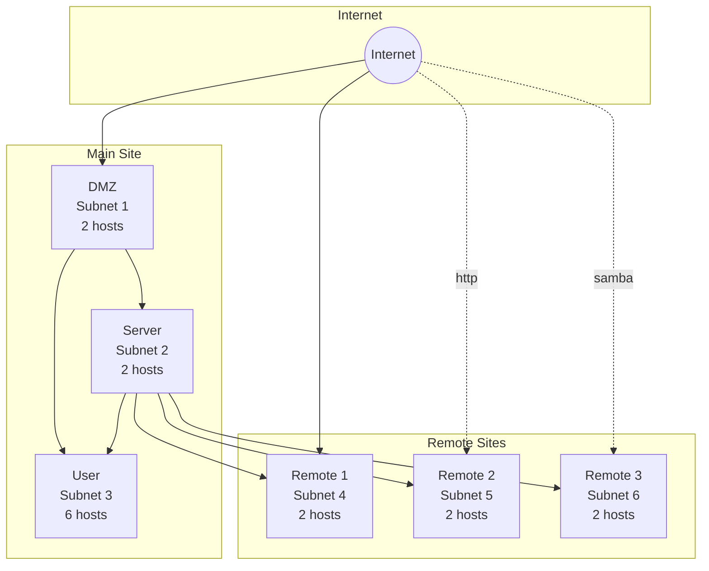
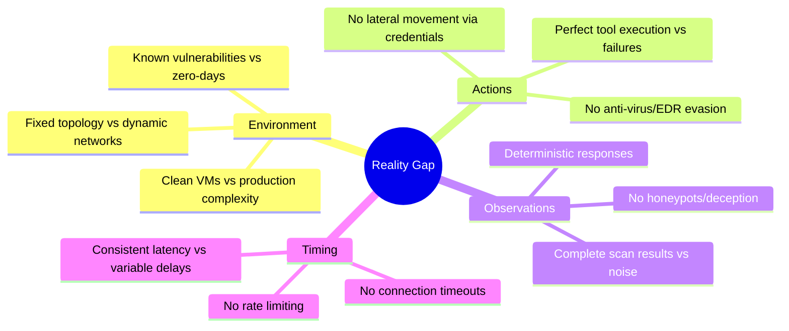

# PenGym Environment Analysis
> Phân tích chuyên sâu thư viện môi trường RL cho Penetration Testing

---

## 1. Kiến Trúc Tổng Quan

### 1.1 Mối Quan Hệ Kế Thừa



PenGym mở rộng **NASim** (Network Attack Simulator) để thực thi hành động trên hệ thống thực thay vì mô phỏng:

| Component | NASim (Base) | PenGym (Extended) |
|-----------|--------------|-------------------|
| Environment | Simulation | Real VMs via KVM |
| Actions | Probabilistic | nmap/Metasploit execution |
| State | Tensor-based | `host_map` + real observations |
| Network | Graph topology | CyRIS cyber range |

### 1.2 Cấu Trúc Files Chính

```
PenGym/
├── pengym/
│   ├── __init__.py          # create_environment(), load()
│   ├── CONFIG.yml            # Global configuration
│   ├── utilities.py          # Metasploit/nmap integration
│   ├── storyboard.py         # Constants definitions
│   └── envs/
│       ├── environment.py    # PenGymEnv class
│       ├── network.py        # PenGymNetwork class
│       ├── host_vector.py    # PenGymHostVector - action execution
│       └── state.py          # PenGymState class
├── database/
│   ├── scenarios/            # YAML scenario definitions
│   └── resources/            # Vulnerable service packages
└── run.py                    # Demo execution script
```

---

## 2. Khởi Tạo và Cấu Hình Môi Trường

### 2.1 Luồng Khởi Tạo



### 2.2 Cấu Hình Cyber Range (CONFIG.yml)

```yaml
# Core paths
pengym_source: /home/cyuser/public/PenGym
cyber_range_dir: /home/cyuser/public/cyris/cyber_range

# Network addressing
host_mgmt_addr: 172.16.1.4      # Management interface
host_virbr_addr: 192.168.122.1  # Virtual bridge

# Metasploit RPC
msfrpc_config:
  msfrpc_client_pwd: my_password
  port: 55553
  ssl: True

# Service-to-port mapping
service_port:
  ssh: 22
  ftp: 21
  http: 80
  smtp: 25
  samba: 445
```

### 2.3 CyRIS Integration

PenGym sử dụng **CyRIS** (Cyber Range Instantiation System) để tạo cyber range:

1. **Base VM**: Ubuntu 20.04 LTS images quản lý qua KVM
2. **Guest Configuration**: Mỗi host được clone từ base VM với:
   - Vulnerable services (vsftpd-2.3.4, opensmtpd-6.6.1p1, apache-2.4.49, samba-4.5.9)
   - Network interfaces và IP addressing
   - Firewall rules theo scenario

3. **Network Topology**: Các subnet được nối qua Linux bridges:
   ```python
   # Bridge naming convention
   bridge_name = f"br{subnet_ip.replace('.', '-')}"  # e.g., br-192-168-1
   ```

### 2.4 host_map - State Tracking

```python
host_map[address] = {
    'host_ip': ['192.168.1.10'],      # List of IP addresses
    'subnet_ip': '192.168.1.0/24',    # Subnet CIDR
    'kvm_domain': 'cr44-guest-3-1',   # KVM VM name
    'bridge_up': False,                # Network bridge status
    'shell': None,                     # Metasploit shell session
    'os': None,                        # Discovered OS
    'services': None,                  # Discovered services dict
    'processes': None,                 # Discovered processes dict
    'pe_shell': {},                    # Privilege escalation shells
    'exploit_access': {},              # Access level per exploit
    'access': 0.0,                     # Current access level (0=None, 1=User, 2=Root)
    'default_gw': None,                # Default gateway status
    'service_scan_state': True,        # Need service scan?
    'os_scan_state': True,             # Need OS scan?
    'service_exploit_state': True      # Exploit available?
}
```

---

## 3. Action Space

### 3.1 Định Nghĩa Action Space

Action space được tính dựa trên scenario:

```
|A| = num_hosts × (num_scans + num_exploits + num_privesc)
```

Với `medium-multi-site` scenario:
- 16 hosts
- 4 scan actions (service, OS, subnet, process)
- 5 exploits (ssh, ftp, http, samba, smtp)
- 3 privilege escalation (tomcat, proftpd, cron)

**Total: 16 × 12 = 192 actions**

### 3.2 Action Types và Mapping tới Tools

| Action Type | Tool Used | nmap Arguments | Metasploit Module |
|-------------|-----------|----------------|-------------------|
| **ServiceScan** | nmap | `-Pn -n -sS -sV -T5` | - |
| **OSScan** | nmap | `-Pn -n -O -T5` | - |
| **SubnetScan** | nmap | `-Pn -n -sS -T5 --min-parallel 100` | - |
| **ProcessScan** | shell | `ps -ef` | Via existing session |
| **e_ssh** | Metasploit | - | `scanner/ssh/ssh_login` |
| **e_ftp** | Metasploit | - | `unix/ftp/vsftpd_234_backdoor` |
| **e_http** | Metasploit | - | `multi/http/apache_normalize_path_rce` |
| **e_samba** | Metasploit | - | `linux/samba/is_known_pipename` |
| **e_smtp** | Metasploit | - | `unix/smtp/opensmtpd_mail_from_rce` |
| **pe_tomcat** | Metasploit | - | `linux/local/cve_2021_4034_pwnkit_lpe_pkexec` |
| **pe_proftpd** | Metasploit | - | `unix/ftp/proftpd_133c_backdoor` |
| **pe_cron** | Metasploit | - | `linux/local/cron_persistence` |

### 3.3 Action Constraints

```python
# From host_vector.py - Permission check
if not (self.compromised and action.req_access <= self.access):
    result = ActionResult(False, permission_error=True)
    return next_state, result
```

**Prerequisites:**
1. **Exploit actions**: Require traffic permission qua firewall và subnet connectivity
2. **Process scan**: Require compromised host với user access
3. **Privilege escalation**: Require existing shell session

### 3.4 Code: Action Execution Flow

```python
# host_vector.py - perform_action() simplified
def perform_action(self, action):
    next_state = self.copy()
    
    if action.is_service_scan():
        if utils.ENABLE_PENGYM:
            service_dict = utils.host_map[self.address]['services']
            if service_scan_state:
                service_result, exec_time = self.do_service_scan(host_ip, nm, ports)
                service_dict = utils.map_result_list_to_dict(service_result, scenario_services)
                utils.host_map[self.address]['services'] = service_dict
            result = ActionResult(True, services=service_dict)
        return next_state, result
    
    if action.is_exploit():
        exploit_result, access, exec_time = self.do_exploit(host_ip, host_ip_list, action.service)
        if exploit_result:
            next_state.compromised = True
            next_state.access = action.access
            result = ActionResult(True, value=value, access=access)
        return next_state, result
```

---

## 4. Observation Space

### 4.1 State Vector Structure

Observation space được định nghĩa bởi NASim và PenGym inherits nó:

```python
# Per-host observation vector (from NASim)
host_obs = [
    compromised,      # 0 or 1
    reachable,        # 0 or 1
    discovered,       # 0 or 1
    value,            # host value (reward)
    discovery_value,  # discovery reward
    access,           # 0=None, 1=User, 2=Root
    *os_vector,       # one-hot encoded OS
    *services_vector, # binary service indicators
    *processes_vector # binary process indicators
]
```

### 4.2 Observation Modes

| Mode | `flat_obs` | `fully_obs` | Description |
|------|------------|-------------|-------------|
| Flat Partially Observable | True | False | 1D vector, only observed info |
| Flat Fully Observable | True | True | 1D vector, complete state |
| Matrix Partially Observable | False | False | 2D matrix (hosts × features) |
| Matrix Fully Observable | False | True | 2D matrix, complete state |

### 4.3 Thông Tin Thu Thập từ Scans

| Scan Type | Information Gathered | PenGym Source |
|-----------|---------------------|---------------|
| ServiceScan | `{'ssh': 1.0, 'ftp': 0.0, ...}` | nmap `-sV` output |
| OSScan | `{'linux': 1.0}` | nmap `-O` osmatch |
| SubnetScan | `{(2,1): True, (3,0): True, ...}` | nmap host discovery |
| ProcessScan | `{'tomcat': 1.0, 'cron': 0.0}` | `ps -ef` via shell |

---

## 5. Hàm step() và Reward Mechanism

### 5.1 Step Function Flow

```mermaid
flowchart TD
    A[env.step(action_idx)] --> B[Get Action object]
    B --> C[network.perform_action(state, action)]
    C --> D{Action Type?}
    
    D -->|Scan| E[host_vector.perform_action()]
    D -->|SubnetScan| F[network._perform_subnet_scan()]
    D -->|Exploit/PE| E
    
    E --> G{ENABLE_PENGYM?}
    G -->|Yes| H[Execute real tool]
    G -->|No| I[NASim simulation]
    
    H --> J[Update host_map]
    J --> K[Create ActionResult]
    I --> K
    
    K --> L[Calculate reward]
    L --> M[Check done condition]
    M --> N[Return obs, reward, done, truncated, info]
```

### 5.2 Reward Calculation

```python
# From scenario YAML
exploits:
  e_ssh:
    cost: 3        # Action cost
    access: user   # Gained access level
    prob: 0.999999 # Success probability
    
sensitive_hosts:
  (2, 1): 100      # Reward value for compromising
  (3, 4): 100      # Reward value for compromising
```

**Reward Formula:**
```
reward = host_value (if ROOT access gained) - action_cost
       + discovery_value (for newly discovered hosts)
```

**Example:**
- Exploit HTTP thành công trên sensitive host `(3,4)` với ROOT access: `reward = 100 - 2 = 98`
- Service scan: `reward = 0 - 1 = -1` (cost only, no value)
- Subnet scan discovering 5 hosts: `reward = 5 × discovery_value - 1`

### 5.3 Done Condition

```python
# Episode ends when all sensitive hosts are compromised with ROOT access
def goal_reached(self):
    for sensitive_host, _ in self.sensitive_hosts:
        if not self.host_has_access(sensitive_host, AccessLevel.ROOT):
            return False
    return True
```

### 5.4 Reward Design Analysis

| Aspect | Implementation | Evaluation |
|--------|----------------|------------|
| **Sparse vs Dense** | Sparse - big rewards only for sensitive hosts | May slow learning |
| **Shaping** | Discovery rewards provide intermediate signal | Helps exploration |
| **Penalty** | Action costs penalize unnecessary actions | Encourages efficiency |
| **Reward Hacking Risk** | Low - sensitive hosts require actual compromise | Good design |

> [!NOTE]
> Reward spareness có thể được cải thiện bằng intermediate rewards cho service discovery hoặc access level progression.

---

## 6. Hàm reset() và Episode Management

### 6.1 Reset Flow

```python
# From utilities.py
def reset_host_map():
    for address in host_map.keys():
        host_map[address]['bridge_up'] = False
        host_map[address]['shell'] = None
        host_map[address]['os'] = None
        host_map[address]['services'] = None
        host_map[address]['processes'] = None
        host_map[address]['pe_shell'] = {}
        host_map[address]['exploit_access'] = {}
        host_map[address]['access'] = 0.0
        host_map[address]['service_scan_state'] = True
        host_map[address]['os_scan_state'] = True
        host_map[address]['service_exploit_state'] = True
```

### 6.2 Metasploit Session Cleanup

```python
def cleanup_msfrpc_client():
    if msfrpc_client:
        # Stop all jobs
        for job_id in msfrpc_client.jobs.list:
            msfrpc_client.jobs.stop(job_id)
        # Stop all sessions (shells, meterpreters)
        for session_key in msfrpc_client.sessions.list:
            msfrpc_client.sessions.session(session_key).stop()
```

### 6.3 Firewall Restoration

```python
# Restore original firewall rules after episode
utils.save_restore_firewall_rules_all_hosts(flag='restore')
```

---

## 7. Network Topology và Firewall

### 7.1 Topology Matrix

```yaml
# medium-multi-site.yml
topology: [[ 1, 1, 0, 0, 1, 1, 1],    # 0 - internet
           [ 1, 1, 1, 1, 0, 0, 0],    # 1 - MS-DMZ
           [ 0, 1, 1, 1, 1, 1, 1],    # 2 - MS-Server
           [ 0, 1, 1, 1, 0, 0, 0],    # 3 - MS-User
           [ 1, 0, 1, 0, 1, 0, 0],    # 4 - RS-1
           [ 1, 0, 1, 0, 0, 1, 0],    # 5 - RS-2
           [ 1, 0, 1, 0, 0, 0, 1]]    # 6 - RS-3
```



### 7.2 Firewall Rules

```yaml
firewall:
  (0, 5): [http]   # Internet → RS-2: only HTTP allowed
  (0, 6): [samba]  # Internet → RS-3: only Samba allowed
  (2, 3): [http]   # Server → User: only HTTP allowed
  (3, 2): [smtp]   # User → Server: only SMTP allowed
  (2, 6): [ftp, ssh] # Server → RS-3: FTP and SSH allowed
```

### 7.3 Traffic Permission Check

```python
# network.py
def subnet_traffic_permitted(self, src_subnet, dest_subnet, service, src_compromised=True):
    if src_subnet == dest_subnet:
        if src_compromised:
            return True  # Same subnet, compromised source
        if self.subnet_public(src_subnet):
            return service in self.firewall[(0, dest_subnet)]
        return True
    
    if not self.subnets_connected(src_subnet, dest_subnet):
        return False
    
    return service in self.firewall[(src_subnet, dest_subnet)]
```

---

## 8. Độ Ổn Định và Xử Lý Ngoại Lệ

### 8.1 Error Handling Mechanisms

```python
# PenGym error flag for tracking execution issues
utils.PENGYM_ERROR = False

# Exploit execution with timeout
flag = True
while flag:
    if job_id not in msfrpc.jobs.list:
        print("* WARNING: Job does not exist")
        flag = False
    
    shell_id = self.get_current_shell_id(msfrpc, host_ip_list, service, arch)
    if shell_id:
        flag = False
        break
```

### 8.2 Timeout Handling

| Operation | Timeout | Handling |
|-----------|---------|----------|
| SSH Exploit | `SSH_TIMEOUT: 3` | Configurable in Metasploit |
| SMTP Exploit | `ExpectTimeout: 5, ConnectTimeout: 50` | Module parameters |
| Process Scan | 30 seconds | While loop with time check |
| Shell Response | 1 second initial + 0.1s polling | Incremental wait |

### 8.3 Latency Considerations

```python
# Real execution times from demo output
Service Scan: 0.9-7.7 seconds
OS Scan: 3.7-5.7 seconds
Exploit (HTTP): 6.6-6.9 seconds
Exploit (SMTP): 6.6 seconds
Subnet Scan: 6.3-15.0 seconds
Privilege Escalation: 17.7 seconds
```

> [!WARNING]
> **Training Implications**: Real execution latency (tổng ~80-120 giây/episode) làm chậm đáng kể quá trình training so với NASim simulation (~ms/episode).

---

## 9. Đánh Giá Độ Thực Tế và Limitations

### 9.1 Realism Assessment

| Aspect | Realism Level | Details |
|--------|---------------|---------|
| **Network Topology** | ★★★★☆ | Realistic multi-subnet WAN with firewall rules |
| **Vulnerability Execution** | ★★★★★ | Real Metasploit modules on real CVEs |
| **Service Detection** | ★★★★★ | Actual nmap scans with production arguments |
| **Access Control** | ★★★★☆ | User/Root levels, prerequisite enforcement |
| **Timing Variance** | ★★★★☆ | Real network latency, tool execution times |

### 9.2 Known Limitations

| Limitation | Impact | Mitigation |
|------------|--------|------------|
| **Fixed Vulnerabilities** | Agents may overfit to specific CVEs | Expand vulnerability database |
| **Deterministic Exploits** | `prob: 0.999999` removes stochasticity | Use realistic success rates |
| **No IDS/IPS** | No detection risk | Add detection mechanisms |
| **Limited Services** | Only 5 services | Expand service variety |
| **Single OS** | Only Linux | Add Windows support |
| **No Patching** | Vulnerabilities don't change | Implement dynamic patching |

### 9.3 Reality Gap Analysis



### 9.4 Recommendations for Improvement

1. **Stochastic Success Rates**: Giảm `prob` xuống realistic levels (0.6-0.8)
2. **Detection System**: Thêm IDS simulation với detection probability
3. **Dynamic Vulnerabilities**: Randomize vulnerabilities mỗi episode
4. **Credential Reuse**: Implement password spraying và credential harvesting
5. **Noise Injection**: Add false positives/negatives vào scan results
6. **Rate Limiting**: Simulate firewall rate limits và temporary blocks

---

## 10. So Sánh với Project Script Hiện Tại

| Feature | PenGym | Script Project |
|---------|--------|----------------|
| **Environment Type** | Real VMs (KVM) | Simulated |
| **Action Execution** | Metasploit/nmap | Function calls |
| **State Encoding** | NASim vectors | SBERT embeddings |
| **Action Space** | Discrete (flat) | Discrete (flat) |
| **Reward** | Host value - cost | Success reward - cost |
| **Network** | Multi-subnet topology | Single host focus |
| **Training Speed** | Slow (real execution) | Fast (simulation) |
| **Transferability** | High (real tools) | Requires adaptation |

---

## 11. Kết Luận

### 11.1 Điểm Mạnh
- ✅ Real execution trên actual VMs tăng transferability
- ✅ Standard Gymnasium API cho compatibility với RL frameworks
- ✅ Comprehensive action set covering reconnaissance và exploitation
- ✅ Realistic network topology với firewall constraints
- ✅ Extensible architecture thông qua NASim inheritance

### 11.2 Thách Thức
- ⚠️ Training speed bị giới hạn bởi real execution time
- ⚠️ Setup complexity yêu cầu CyRIS, KVM, Metasploit
- ⚠️ Limited vulnerability và service diversity
- ⚠️ No adversarial elements (IDS, honeypots)

### 11.3 Use Cases Phù Hợp
1. **Final Evaluation**: Test trained agents trên real systems
2. **Sim-to-Real Transfer**: Validate simulation-trained policies
3. **Red Team Training**: Human training với realistic scenarios
4. **Research**: Study RL behavior với real-world constraints

---

## References

1. [PenGym GitHub Repository](https://github.com/cyb3rlab/PenGym)
2. [NASim - Network Attack Simulator](https://github.com/Jjschwartz/NetworkAttackSimulator)
3. [CyRIS - Cyber Range Instantiation System](https://github.com/crond-jaist/cyris)
4. Nguyen et al., "PenGym: Realistic training environment for reinforcement learning pentesting agents", Computers & Security, 2025
