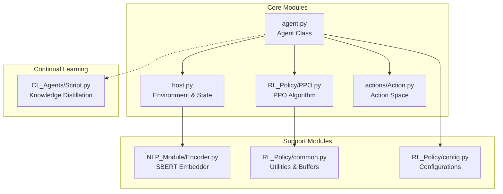
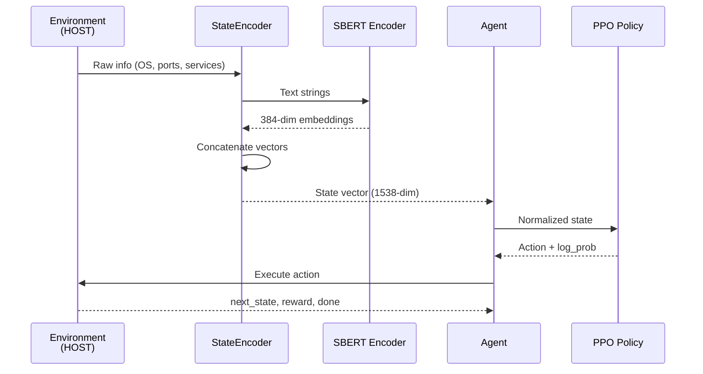
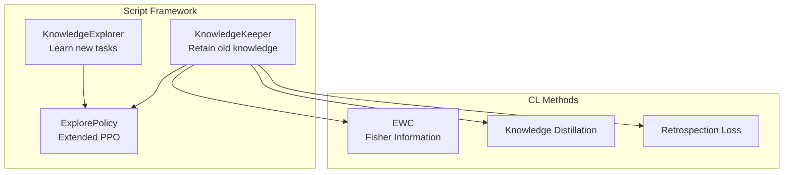

# Phân Tích Toàn Diện Dự Án RL - Penetration Testing Agent

## 1. Tổng Quan Kiến Trúc Hệ Thống

### 1.1 Mục Tiêu Bài Toán
Dự án xây dựng một **Reinforcement Learning Agent** cho bài toán **Automated Penetration Testing**. Agent học cách tấn công các target hosts bằng cách thực hiện chuỗi hành động (scan → exploit) để đạt được quyền truy cập "compromised".

### 1.2 Cấu Trúc Module Chính



| Module | File | Chức Năng |
|--------|------|-----------|
| **Agent** | `agent.py` | Training loop, episode management, evaluation |
| **Policy** | `RL_Policy/PPO.py` | PPO algorithm, Actor-Critic networks |
| **Environment** | `host.py` | State encoding, step function, reward calculation |
| **Actions** | `actions/Action.py` | Action space definition, constraints |
| **Encoder** | `NLP_Module/Encoder.py` | SBERT embedding for state representation |
| **CL** | `CL_Agents/Script.py` | Continual learning with EWC + Knowledge Distillation |

---

## 2. Luồng Dữ Liệu (Data Flow)

### 2.1 Pipeline Xử Lý Dữ Liệu



### 2.2 Chi Tiết State Encoding

**File:** [host.py](file:///d:/NCKH/fusion/Script/host.py#L161-L206)

State vector được xây dựng bằng cách concatenate các thành phần:

```python
state_space = access_dim + os_dim + port_dim + service_dim + web_fingerprint_dim
# = 2 + 384 + 384 + 384 + 384 = 1538 dimensions
```

| Component | Dimension | Encoding Method |
|-----------|-----------|-----------------|
| `access` | 2 | One-hot: `[1,0]` = compromised, `[0,1]` = reachable |
| `os` | 384 | SBERT embedding của OS string |
| `port` | 384 | SBERT embedding của port list joined |
| `services` | 384 | SBERT embedding của services list |
| `web_fingerprint` | 384 | SBERT embedding trung bình của các fingerprints |

**Đánh giá:**
> [!TIP]
> Việc sử dụng SBERT embeddings cho phép agent xử lý các thông tin text-based một cách linh hoạt, không cần fixed vocabulary. Đây là thiết kế phù hợp vì thông tin từ OS, services có thể rất đa dạng.

---

## 3. Kiến Trúc Mạng Neural

### 3.1 Actor Network (Policy Network)

**File:** [RL_Policy/PPO.py](file:///d:/NCKH/fusion/Script/RL_Policy/PPO.py#L37-L61)

```python
class Actor(nn.Module):
    def __init__(self, state_dim, action_dim, hidden_shape, activate_func="relu"):
        self.net = build_net(
            input_dim=state_dim,      # 1538
            output_dim=action_dim,    # len(legal_actions) 
            hidden_shape=hidden_shape, # [512, 512]
            hid_activation=activate_func
        )
    
    def forward(self, state):
        dist = F.softmax(self.net(state), dim=-1)
        return dist  # Action probability distribution
```

**Architecture:**
```
Input(1538) → Linear(512) → Tanh → Linear(512) → Tanh → Linear(action_dim) → Softmax
```

### 3.2 Critic Network (Value Network)

**File:** [RL_Policy/PPO.py](file:///d:/NCKH/fusion/Script/RL_Policy/PPO.py#L75-L97)

```python
class Critic(nn.Module):
    def __init__(self, state_dim, hidden_shape, activate_func="relu"):
        self.net = build_net(
            input_dim=state_dim,      # 1538
            output_dim=1,             # State value
            hidden_shape=hidden_shape  # [512, 512]
        )
    
    def forward(self, state):
        return self.net(state)  # V(s)
```

**Architecture:**
```
Input(1538) → Linear(512) → Tanh → Linear(512) → Tanh → Linear(1)
```

### 3.3 Hyperparameters (Default Config)

**File:** [RL_Policy/config.py](file:///d:/NCKH/fusion/Script/RL_Policy/config.py#L39-L76)

| Parameter | Value | Ý nghĩa |
|-----------|-------|---------|
| `hidden_sizes` | [512, 512] | 2 hidden layers, mỗi layer 512 neurons |
| `activate_func` | "tanh" | Hàm kích hoạt cho hidden layers |
| `actor_lr` | 1e-4 | Learning rate cho Actor |
| `critic_lr` | 5e-5 | Learning rate cho Critic |
| `gamma` | 0.99 | Discount factor |
| `gae_lambda` | 0.95 | GAE lambda |
| `policy_clip` | 0.2 | PPO clip range |
| `entropy_coef` | 0.02 | Entropy bonus coefficient |
| `batch_size` | 512 | Transitions per update |
| `mini_batch_size` | 64 | Mini-batch for SGD |
| `ppo_update_time` | 8 | Epochs per update |

**Đánh giá kiến trúc:**
> [!NOTE]
> - **Phù hợp:** Hidden size (512) đủ lớn để encode state 1538-dim, 2 layers phù hợp với discrete action space
> - **Tanh activation:** Giới hạn output trong [-1,1], ổn định hơn ReLU cho policy gradients
> - **Separate learning rates:** Actor có lr cao hơn Critic (1e-4 vs 5e-5) là best practice cho PPO

---

## 4. Không Gian Trạng Thái và Hành Động

### 4.1 State Space

**Dimension:** 1538 (với SBERT 384-dim)

**Components:**
1. **Access state** (2-dim): Trạng thái truy cập hiện tại
2. **OS embedding** (384-dim): Thông tin hệ điều hành  
3. **Port embedding** (384-dim): Các port đang mở
4. **Service embedding** (384-dim): Services trên các ports
5. **Web fingerprint embedding** (384-dim): Web fingerprints

### 4.2 Action Space

**File:** [actions/Action.py](file:///d:/NCKH/fusion/Script/actions/Action.py#L20-L80)

```python
# Scan Actions (4 actions)
Scan_actions = [PORT_SCAN, SERVICE_SCAN, OS_SCAN, WEB_SCAN]

# Exploit Actions (loaded from vulnerability database)
All_EXP = [Action_Class(...) for v in Vul_set]

# Total Action Space
legal_actions = Scan_actions + All_EXP
action_space = len(legal_actions)  # 4 + N exploits
```

**Action Types:**

| Action | Cost | Success Reward | Prerequisites |
|--------|------|----------------|---------------|
| PORT_SCAN | 0 | 0 | None |
| SERVICE_SCAN | 0 | 100 | PORT_SCAN |
| OS_SCAN | 0 | 100 | PORT_SCAN |
| WEB_SCAN | 0 | 100 | SERVICE_SCAN |
| Exploit Actions | 10 | 1000 | PORT_SCAN |

### 4.3 Action Constraints

**File:** [actions/Action.py](file:///d:/NCKH/fusion/Script/actions/Action.py#L123-L153)

```python
def action_constraint(self, action: Action_Class, host_info: Host_info):
    # Prevent duplicate actions
    if action.name == self.PORT_SCAN.name:
        if host_info.port:  # Already scanned
            return self.action_repetition  # Cost = 5
    
    # Enforce prerequisites
    if action.name == self.SERVICE_SCAN.name:
        if not host_info.port:
            return self.PORT_required  # Cost = 10
    
    # Exploits require port info
    if action.type == "Exploit":
        if not host_info.port:
            return self.PORT_required
```

> [!IMPORTANT]
> Action constraints tạo implicit reward shaping bằng cách penalize các hành động không hợp lệ (cost = 5-10). Điều này giúp agent học được thứ tự hành động đúng.

---

## 5. Hàm Phần Thưởng (Reward Function)

### 5.1 Cấu Trúc Reward

**File:** [host.py](file:///d:/NCKH/fusion/Script/host.py#L62-L159)

```python
def step(self, action_mask: int):
    done = 0
    reward = 0
    
    # Check action constraints
    action_constraint = self.action.action_constraint(action=a, host_info=self.info)
    if action_constraint:
        cost = action_constraint.cost  # Penalty: 5-10
        result = action_constraint.message
    else:
        cost = a.act_cost  # Action execution cost
        
        # Execute action and get success reward
        if a.name == "Port Scan":
            if action.port_list:
                reward = a.success_reward  # 0
        elif a.name == "OS Detect":
            if action.os:
                reward = a.success_reward  # 100
        elif a.type == "Exploit":
            if result:  # Exploit succeeded
                reward = a.success_reward  # 1000
    
    # Final reward = success_reward - cost
    reward = int(reward - cost)
    done = self.state_vector.goal_reached()  # 1 if compromised
    
    return next_state, reward, done, result
```

### 5.2 Reward Structure Analysis

| Scenario | Reward | Analysis |
|----------|--------|----------|
| Valid PORT_SCAN | 0 | Neutral - không khuyến khích cũng không phạt |
| Valid OS_SCAN/SERVICE_SCAN | +100 | Khuyến khích thu thập thông tin |
| WEB_SCAN (first time) | +100 | Khuyến khích, lần sau = 0 |
| Successful Exploit | +1000 | Reward lớn nhất cho goal |
| Invalid action (constraint) | -5 to -10 | Penalty cho hành động sai |
| Failed exploit | -10 | Chi phí thực hiện exploit |

### 5.3 Đánh Giá Reward Design

> [!WARNING]
> **Potential Issues:**
> 1. **Sparse reward problem:** Reward +1000 chỉ khi exploit thành công, có thể gây khó khăn cho exploration
> 2. **No intermediate feedback:** Không có reward cho việc "gần" tìm được exploit đúng
> 3. **Risk of reward hacking:** Agent có thể spam OS_SCAN/SERVICE_SCAN để farm +100 reward nếu không có duplicate check

**Mitigations trong code:**
- Duplicate action check với penalty -5
- WebScan counts để giảm reward sau lần đầu
- Step limit để tránh infinite episode

---

## 6. Training Loop và PPO Update

### 6.1 Training Episode Flow

**File:** [agent.py](file:///d:/NCKH/fusion/Script/agent.py#L327-L434)

```python
def run_train_episode(self, target_list, explore=False):
    for target in target_list:
        o = target.reset()
        if self.use_state_norm:
            o = self.state_norm(o)  # Normalize state
        
        while not done and target_step < step_limit:
            # 1. Select action
            action_info = self.Policy.select_action(o)
            a = action_info[0]
            
            # 2. Execute in environment
            next_o, r, done, result = target.perform_action(a)
            
            # 3. Apply reward scaling
            if self.use_reward_scaling:
                r = self.reward_scaling(r)
            
            # 4. Store transition
            self.Policy.store_transtion(o, action_info, r, next_o, done)
            
            # 5. Update policy
            if not explore:
                self.Policy.update_policy(num_episode, train_steps)
                if self.use_lr_decay:
                    self.Policy.lr_decay(rate)
            
            o = next_o
```

### 6.2 PPO Update Algorithm

**File:** [RL_Policy/PPO.py](file:///d:/NCKH/fusion/Script/RL_Policy/PPO.py#L251-L328)

```python
def update(self, train_steps):
    s, a, a_logprob, r, s_, dw, done = self.memory.numpy_to_tensor()
    
    # 1. Calculate GAE Advantage
    with torch.no_grad():
        vs = self.critic(s)
        vs_ = self.critic(s_)
        deltas = r + self.gamma * (1.0 - dw) * vs_ - vs
        
        gae = 0
        for delta, d in zip(reversed(deltas), reversed(done)):
            gae = delta + self.gamma * self.gae_lambda * gae * (1.0 - d)
            adv.insert(0, gae)
        
        v_target = adv + vs
        if self.config.use_adv_norm:
            adv = (adv - adv.mean()) / (adv.std() + 1e-5)
    
    # 2. PPO Update Loop
    for _ in range(self.ppo_update_time):  # 8 epochs
        for mini_batch in BatchSampler(range(batch_size), mini_batch_size):
            # Actor loss
            dist_now = Categorical(probs=self.actor(s[index]))
            a_logprob_now = dist_now.log_prob(a[index])
            ratios = torch.exp(a_logprob_now - a_logprob[index])
            
            surr1 = ratios * adv[index]
            surr2 = torch.clamp(ratios, 1-clip, 1+clip) * adv[index]
            actor_loss = -torch.min(surr1, surr2)
            actor_loss = actor_loss - entropy_coef * dist_entropy  # Entropy bonus
            
            # Gradient update with clipping
            torch.nn.utils.clip_grad_norm_(self.actor.parameters(), 0.5)
            
            # Critic loss
            v_s = self.critic(s[index])
            critic_loss = F.mse_loss(v_target[index], v_s)
            torch.nn.utils.clip_grad_norm_(self.critic.parameters(), 0.5)
```

### 6.3 Mathematical Formulation

**GAE Advantage Estimation:**
$$\hat{A}_t = \sum_{l=0}^{\infty} (\gamma \lambda)^l \delta_{t+l}$$
$$\delta_t = r_t + \gamma V(s_{t+1}) - V(s_t)$$

**PPO Clipped Objective:**
$$L^{CLIP}(\theta) = \hat{\mathbb{E}}_t \left[ \min \left( r_t(\theta) \hat{A}_t, \text{clip}(r_t(\theta), 1-\epsilon, 1+\epsilon) \hat{A}_t \right) \right]$$

**Total Loss:**
$$L = L^{CLIP} - c_1 L^{VF} + c_2 H[\pi_\theta]$$

> [!NOTE]
> Implementation follows standard PPO-Clip với GAE. Gradient clipping (0.5) giúp ổn định training.

---

## 7. Replay Buffer

### 7.1 PPO Replay Buffer

**File:** [RL_Policy/common.py](file:///d:/NCKH/fusion/Script/RL_Policy/common.py#L361-L392)

```python
class ReplayBuffer_PPO:
    def __init__(self, batch_size, state_dim):
        self.s = np.zeros((batch_size, state_dim))
        self.a = np.zeros((batch_size, 1))
        self.a_logprob = np.zeros((batch_size, 1))
        self.r = np.zeros((batch_size, 1))
        self.s_ = np.zeros((batch_size, state_dim))
        self.dw = np.zeros((batch_size, 1))  # dead or win
        self.done = np.zeros((batch_size, 1))
        self.count = 0
```

**Đặc điểm:**
- Fixed-size buffer (batch_size = 512)
- On-policy: Buffer được clear sau mỗi update
- Store log probability cho importance sampling

### 7.2 Priority Replay Buffer (Available)

**File:** [RL_Policy/common.py](file:///d:/NCKH/fusion/Script/RL_Policy/common.py#L252-L300)

```python
class ReplayMemoryPER:
    # Prioritized Experience Replay với SumTree
    # Có sẵn nhưng không được sử dụng trong PPO
```

---

## 8. Continual Learning Module

### 8.1 Architecture

**File:** [CL_Agents/Script.py](file:///d:/NCKH/fusion/Script/CL_Agents/Script.py)



### 8.2 Key Components

| Class | Chức năng |
|-------|-----------|
| `KnowledgeExplorer` | Học task mới với curriculum guidance từ expert policy |
| `KnowledgeKeeper` | Consolidate knowledge, prevent catastrophic forgetting |
| `ExplorePolicy` | Extended PPO với guide policy và temperature scaling |

### 8.3 EWC (Elastic Weight Consolidation)

```python
# From config
ewc_lambda = 2000      # Scale của EWC loss
ewc_gamma = 0.99       # Decay cho Fisher information cũ
```

**Loss:**
$$L_{EWC} = L_{task} + \sum_i \frac{\lambda}{2} F_i (\theta_i - \theta_i^*)^2$$

---

## 9. Đánh Giá Chất Lượng Code

### 9.1 Điểm Mạnh

✅ **Modular Design:** Tách biệt rõ ràng giữa Policy, Environment, Actions
✅ **Configurable:** Hyperparameters được tham số hóa qua config classes
✅ **Logging:** Tích hợp TensorBoard và WandB
✅ **State Normalization:** Running mean/std cho stable training
✅ **Gradient Clipping:** Prevent exploding gradients

### 9.2 Potential Bottlenecks

> [!CAUTION]
> **Memory Issues:**

**1. SBERT Encoding mỗi step:**
```python
# host.py:282
vector = encoder.encode_SBERT(all_ports).flatten()
```
- Mỗi lần update state đều gọi SBERT encoder
- SBERT model (~100MB) ở trong memory

**2. State vector size lớn:**
- 1538 dimensions × float32 = 6.15 KB per state
- Batch 512 states ≈ 3.1 MB

### 9.3 Code Quality Issues

**1. Hardcoded values:**
```python
# PPO.py:307
torch.nn.utils.clip_grad_norm_(self.actor.parameters(), 0.5)  # Magic number
```

**2. Unused code:**
```python
# common.py:193 - action_history_dim = 0 (disabled)
action_history_dim = 0  #弃用
```

**3. Mixed language comments:**
```python
# host.py:40
self.env_data = env_data  #环境数据，用于执行动作丛中获得反馈
```

### 9.4 Recommendations

| Issue | Recommendation | Priority |
|-------|----------------|----------|
| SBERT bottleneck | Cache embeddings cho repeated strings | High |
| Magic numbers | Move to config | Medium |
| Unused code | Clean up action_history feature | Low |
| Comments | Standardize to English | Low |
| Missing typing | Add type hints throughout | Medium |

---

## 10. Đề Xuất Cải Thiện

### 10.1 Performance Optimization

```python
# 1. Cache SBERT embeddings
class CachedEncoder:
    def __init__(self, encoder):
        self.cache = {}
        self.encoder = encoder
    
    def encode(self, text):
        if text not in self.cache:
            self.cache[text] = self.encoder.encode_SBERT(text)
        return self.cache[text]
```

### 10.2 Training Stability

```python
# 2. Add learning rate scheduler
scheduler = torch.optim.lr_scheduler.CosineAnnealingLR(
    optimizer, T_max=config.train_eps
)

# 3. Add early stopping based on eval success rate
if eval_success_rate >= 0.95 for N consecutive evals:
    break
```

### 10.3 Reward Shaping Improvements

```python
# 4. Add partial credit for "close" exploits
if exploit_matches_vulnerability:
    if not successful:
        reward = 50  # Partial credit
    else:
        reward = 1000
```

### 10.4 Sim-to-Real Transfer

> [!WARNING]
> Khi chuyển từ simulation sang thực tế:    
> 1. **Timing variance:** Real scans take variable time
> 2. **Noise in observations:** Service banners may be obfuscated
> 3. **Action failure modes:** Network issues, firewalls

**Recommendations:**
- Domain randomization trong training
- Robust state normalization
- Action retry mechanism
- Confidence thresholding cho exploit selection

---

## 11. Tổng Kết

### Theory-to-Code Mapping

| Lý Thuyết | Implementation | Đánh Giá |
|-----------|----------------|----------|
| PPO Algorithm | ✅ Correct | Follows Schulman et al. |
| GAE | ✅ Correct | Standard implementation |
| Actor-Critic | ✅ Correct | Separate networks |
| Entropy Bonus | ✅ Correct | Coefficient = 0.02 |
| EWC | ✅ Correct | Fisher diagonal |

### Architecture Summary

```
State: SBERT(OS, ports, services) → 1538-dim vector
       ↓
Policy: MLP [1538 → 512 → 512 → action_dim]
       ↓
Action: Categorical sampling from softmax
       ↓
Environment: Execute scan/exploit
       ↓
Reward: success_reward - action_cost
```

**Tổng kết:** Dự án implement đúng PPO algorithm cho penetration testing với state representation sáng tạo sử dụng SBERT. Có thể cải thiện về hiệu suất SBERT encoding và thêm các kỹ thuật sim-to-real transfer.
